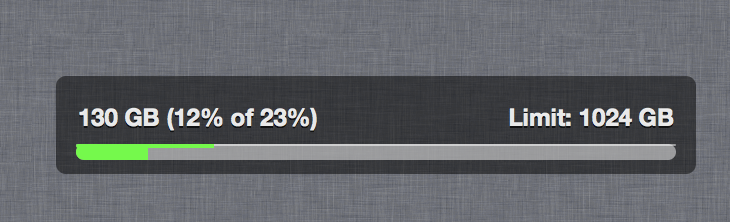

# ComcastUsage

This is simple widget for [Übersicht](http://tracesof.net/uebersicht/) for checking  and showing Comcast usage data.

**Please note: data usage cannot show data for last 24 hours**



## Installation

1. Install robobrowser
    ```
    # pip install robobrowser
    ```

2. Create ~/.netrc file

    ```
    # echo 'machine login.comcast.net'          >> ~/.netrc
    # echo 'login   <your comcast login name>'  >> ~/.netrc
    # echo 'account <your comcast login name>'  >> ~/.netrc
    # echo 'password <your comcast password>'   >> ~/.netrc
    # chmod 600 ~/.netrc
    ```

3. Copy `ComCap.widget` directory to `~/Library/Application Support/Übersicht/widgets/`

4. Test script

    ```
    # ~/Library/Application\ Support/Übersicht/widgets/ComCap.widget/lib/comcap.py
    130 of 1024 GB 12 #00ff00
    ```
_please note: time for gathering data around 10-15 sec_

Enjoy!